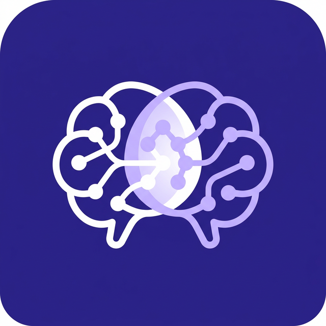

# Conflux — Shared AI Team Memory

> **No context files. No Slack messages. No copy-paste. Just a file save.**

Conflux automatically extracts architectural decisions from your code changes and shares them across your entire team's AI assistants — in real time.

  

## The Problem

AI coding assistants are single-player. Each developer's AI starts blind — it doesn't know what your teammates decided. This causes:

- **Architectural drift** — two people implement the same thing differently
- **Wasted re-explanation** — everyone re-types the same context into their AI
- **Lead developer bottleneck** — only the person who built it can explain it

## How It Works

1. **You save a file** → Conflux detects the change
2. **AI summarizes** → "Using JWT-based auth with Supabase"
3. **Stored locally** → decision goes into your project's Team Brain
4. **Synced instantly** → every teammate's AI can now query it
5. **No manual work** → it all happens in the background

## The Demo

> Two machines. Same project. Both have Conflux.

1. **Machine B** asks its AI: *"How should I implement login?"* → generic answer
2. **Machine A** implements Supabase Auth + JWT and saves the file
3. Conflux extracts the decision automatically
4. **Machine B** asks again → correct, team-aware answer

**No context file. No Slack message. No copy-paste. Just a file save.**

## Quick Start

### 1. Install

Search **"Conflux"** in the VS Code Extensions tab, or download from the [Marketplace](https://marketplace.visualstudio.com/items?itemName=ConfluxAI.conflux-ai).

Works on **VS Code**, **Cursor**, **Windsurf**, and **Google Antigravity**.

### 2. Start Coding

That's it. Conflux runs in the background:

- Extracts decisions from your code changes
- Shows them in the **sidebar** (🧠 icon)
- Displays the latest decision in the **status bar**

### 3. Connect Your Team

`Ctrl+Shift+P` → **Conflux: Start a New Project** → share the 6-digit code with teammates.

Teammates install Conflux, then: `Ctrl+Shift+P` → **Conflux: Join Your Team** → enter the code.

Done. All decisions sync in real time.

## Features

| Feature | Description |
|---------|-------------|
| 🧠 **Auto-Extract** | Detects code changes and extracts architectural decisions using AI |
| 📄 **Decision Timeline** | Beautiful sidebar with timestamped, searchable decision cards |
| 👥 **Team Presence** | See who's online and what they're working on |
| 🔌 **MCP Integration** | Your AI assistant queries the Team Brain automatically |
| ⏳→✅ **Confidence** | Pending (file save) upgrades to Confirmed (git commit) |
| 🔄 **Real-time Sync** | Decisions appear on all teammates' machines in < 5 seconds |
| 🌐 **Offline-First** | Works without internet; syncs when reconnected |

## Commands

| Command | Description |
|---------|-------------|
| `Conflux: Ask Team Brain` | Ask a question — AI answers using team decisions |
| `Conflux: Start a New Project` | Create a project and get a 6-digit team code |
| `Conflux: Join Your Team` | Join a teammate's project with their code |
| `Conflux: Show Status` | Show how many decisions are stored |
| `Conflux: Refresh Decisions` | Refresh the sidebar |

## Built With

- **AI Backend**: AMD MI300X (Qwen 2.5 72B) with Groq fallback
- **Embedding**: On-device CPU via Transformers.js (no GPU needed)
- **Vector Store**: Vectra (embedded, file-based, zero config)
- **Sync**: Supabase Realtime Broadcast
- **MCP**: Python SDK over stdio

## Built For

**AMD Slingshot Hackathon 2026** — *Generative AI for Everyone*

## License

MIT
